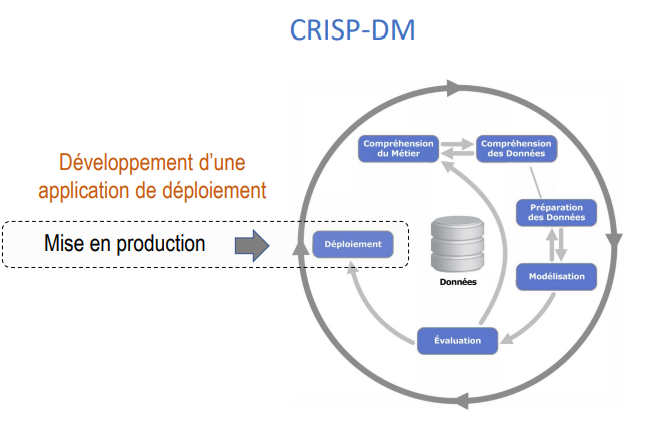
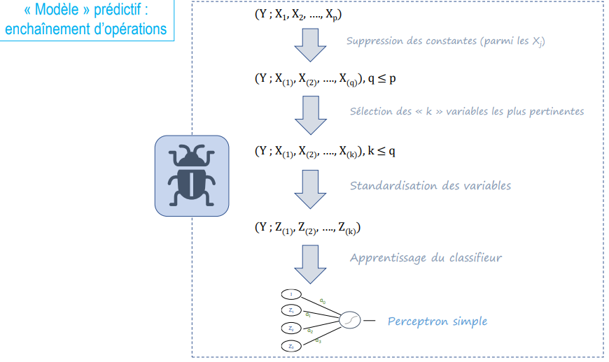

# Déploiement de modèles prédictifs

La mise est production des modèles encore appélée déploiement est une étape très importante des projets de Data Science. 

 <!-- -->

Le but de ce repositoire est de mettre en oeuvre une simulation de deploiement de modèles en cas réels.
Dans la pratique un projet Data Science ne se limite pas à des modèles de machine learning. En effet, plusieurs opérations se sont succèdent avant et après l'entrainement comme le montre le schéma ci-dessous !

 <!-- -->

Les Types de déploiements :

+ Process Equipe Data Science
+ Intégration par les équipes IT
+ Déploiement via Notebook pour un utilisateur final
+ Application Voila
+ Application Streamlit
+ API FlasK
+  Dockers et Kubernetes
